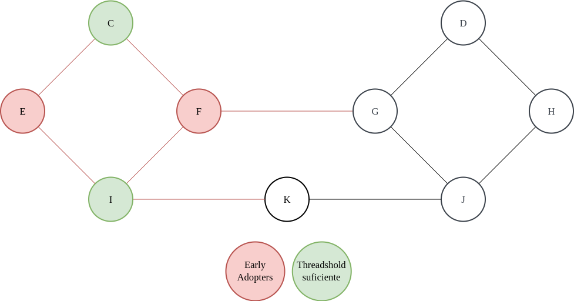

# Teoría de Algoritmos II (75.30)
---
**3.er Parcialito Domiciliario – 13/06/2022 - Fecha de Entrega: 15/07/2022**

*Aclaraciones*: Cada ejercicio dice al final del mismo la cantidad de puntos que otorga por hacerse completamente bien (en total, 10). Se deben obtener al menos 5 puntos para aprobar, y se deben aprobar al menos 3 de los parcialitos para aprobar/regularizar la cursada. Para la fecha de entregar, enviar un mail a mbuchwald@fi.uba.ar con un pdf con la resolución, con nombre P3 - PADRON.pdf. Pueden incluir todo el material adicional que les parezca relevante (desde código hasta gráficos).

1. Se quiere convocar a una elección a la que se presentan 4 candidatos (A, B, C y D). Hay 3 votantes del jurado que tienen sus siguientes rankings individuales:
   
    - Jurado 1: $B \succ C \succ D \succ A$
    - Jurado 2: $C \succ D \succ A \succ B$
    - Jurado 3: $D \succ A \succ B \succ C$

    a. ¿Quién ganaría por eliminación iterativa?
    
    b. ¿Quién ganaría por Borda rule?
    
    c. Suponé que estás a cargo de definir las reglas/formato de la votación, y sos un miembro corrupto que desea que si o si gane la alternativa A (te asegura favores si  logra ganar la elección). Definir (si existe) un sistema de votación en el cual A resulte ganador de la elección. En caso de no existir, explicar por qué. ¿Cuál propiedad deseable de los sistemas de votación no se está cumpliendo si, efectivamente, ganara A?

**[1 Punto]**

a. Por eliminaciones succesivas en orden A,B,C,D ganaría el candidato C:

1. A vs. B -> gana A
2. A vs. C -> gana C
3. C vs. D -> gana C

Por eliminaciones succesivas en orden D,C,B,A ganaría el candidato A:

1. D vs. C -> gana C
2. C vs. B -> gana B
3. B vs. A -> gana A

*Paradoja*: Todos los jurados prefieren a D antes que a A, sin embargo con este sistema de votación sale favorecido el candidato A.

b. Por Borda rule ganaría el candidato D.  

|              | A | B | C | D |
|--------------|---|---|---|---|
|Jurado 1      | 0 | 3 | 2 | 1 |
|Jurado 2      | 1 | 0 | 3 | 2 |
|Jurado 3      | 2 | 1 | 0 | 3 |
|Puntos totales| 3 | 4 | 5 | 6 |

c. Como mencione en el punto *a.* una alternativa para que gane A, suponiendo que sabemos el ranking de cada jurado, podría ser una votación por eliminaciones succesivas en orden D,C,B,A. Aunque todos prefieran a D antes que a A ganaría A, esto quiere decir que A es Pareto-Dominado por D. No se estaría cumpliendo la propiedad de ser Pareto-Eficiente, dado que aunque todos los agentes están de acuerdo en el orden realitvo de preferencias de dos alternativas ($D \succ A$), el sistema de votación no elige en el mimso orden.

---

2. Considerando el modelo de cascadas de información visto en clase, supongamos que hay una nueva tecnología que los individuos pueden optar por aceptar o rechazar. Supongamos que cada uno que acepta la tecnología recibe una ganancia positiva o negativa (sin conocerla a priori). Estos valores son aleatorios para cada nodo, y si la tecnología es “Buena”, entonces el promedio será positivo, y si la tecnología es “Mala” el promedio será negativo (esta información es conocida por los individuos). Quienes rechacen la tecnología reciben ganancia 0. En este modelo, cuando a un individuo le toca elegir si acepta o rechaza la nueva tecnología, recibe la información de las ganancias de todos los que vinieron antes.

    a. Supongamos que esta nueva tecnología es, en realidad, “Mala”. ¿Cómo afecta esta nueva información (qué ganancia tuvo cada uno de los que vinieron antes) a la potencial formación de una cascada para que persista la nueva tecnología? (No es necesario dar una demostración, simplemente argumentar) 
    
    b. Supongamos que esta nueva tecnología es, en realidad, “Buena”. ¿Puede surgir una cascada de rechazo de esta nueva tecnología?

**[2 Puntos]**

a. En este modelo, hasta que haya alguno que sea el primero en aceptar esta nueva tecnología todos los que elijan antes tienen una probabilidad de 0.5 de que la nueva tecnología sea buena o mala, ya que al rechazar, la ganancia es 0. A partir de la elección del primero que acepte la tecnología, el que venga después va a tener el conocimiento de si la tecnología es buena o mala. En el caso que la tecnología sea mala, no le conviene mentir y decir elegir que es buena, ya que tendría ganancia negativa, es preferible tener ganancia 0 y no tomar la tecnología. A partir de ahí nadie le va a convenir aceptar la tecnología. Por tanto esta información haría que no persista la nueva tecnología.

b. El planteo para el caso que la nueva tecnología sea buena es igual, cuando el primero que tomé la decisión de aceptar la tecnología, el resto va a tener conocimientos de si es buena o mala. Sin embargo puede suceder que nadie se quiera arriesgar a aceptar esta nueva tecnología ya que no se recibe ninguna penalización en caso de rechazarla. Por lo tanto, con este modelo hay posibilidad de una cascada de rechazo de la nueva tecnología.

---

3. Considerá la siguiente red, suponiendo que todos los nodos tienen inicialmente un comportamiento B. Cada nodo puede cambiar al comportamiento A si al menos la mitad de sus vecinos tiene dicho comportamiento.

    

    a. Supongamos que los nodos E y F son early adopters del comportamiento A. Si los demás nodos siguen la regla del umbral (threshold) para adherir a este nuevo comportamiento, ¿qué nodos implementarían el comportamiento A?
    
    b. Explicar a qué se debe que el comportamiento A no se propaga a través de toda la red en el escenario del punto (a). ¿Qué característica de la red lo impide? (responder a esta pregunta no apuntando a nodos particulares sino a presencias de ciertas características) ¿Dónde más tendría que haber otro early adopter de A sí o sí para que el comportamiento se propague a través de toda la red?

**[3 Puntos]**

a. Unicamente los nodos C e I adoptarían el nuevo comportamiento, son los únicos que al menos tienen la mitad de sus vecinos con dicho comportamiento.

  

b. Esto se debe a que el grafo del ejercicio tiene comunidades ($E,C,F,I$ y $G,D,H,J$), esto afecta a la propagación de cascadas. Como se ve en este pequeño ejemplo es muy difícil que una cascada salga de una comunidad, sin embargo dentro de la comunidad se propaga de forma más fácil. 

Dado que un conjunto de early adopters ($F$ y $E$) no produjeron una cascada completa, entonces exite un cluster con una densidad mayor a $1-q$, siendo $q$ el threshold. En este ejemplo existe un cluster con una densidad mayor a $0,5$. Además, hay un par de lazos debiles, que le comunican a algunos nodos de la otra comunidad que cierto comportamiento existe, pero no son lo suficiente para que lo adopten.

No es posible agregar simplemente un solo early adopter para que la cascada sea completa.

  
   

  
   

  

Pero colocando 2 ya sería posible. Por ejemplo:

  

---

4. Tenemos dos grafos no dirigidos $G_1$ y $G_2$ , con la misma cantidad de vértices y aristas. $G_1$ es un grafo aleatorio de Erdös-Rényi, mientras $G_2$ es un grafo que cumple la ley de potencias en la distribución de los grados. Consideremos un virus que comienza en un único vértice aleatorio y se expande según el modelo **SIR**.

    a. ¿En cuál grafo es más probable que ocurra una epidemia (i.e. se infecte al menos un 30% de la red)? Justificar brevemente la respuesta. 

    b. Supongamos que en vez de comenzar en un vértice aleatorio, la epidemia comenzara en el vértice de mayor grado de G 1 y G 2 , respectivamente. ¿En cuál de los grafos es más probable que ocurra una epidemia? Justificar brevemente la respuesta.

    c. ¿Cómo afecta la existencia (o no existencia) de comunidades en la expansión de la epidemia?

    Para responder estas preguntas, se les recomienda realizar simulaciones. Pueden agregar todo tipo de resultados obtenidos para justificar sus respuestas.

**[3 Puntos]**

